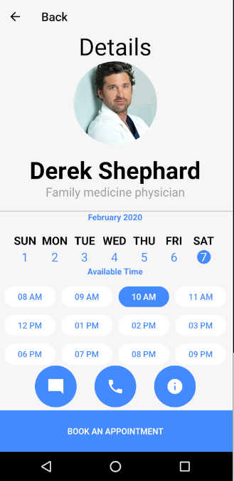

# ejemplo_medical_app

Ejemplo diseñado Ventanas con animacion a pagina informacion. Este ejemplo para acomodar los widget utilice un stack y unicamente se ve bien en un dispositivo de pantalla 5.7". Demuestra la importancia de trabajar siempre con porcentajes y no numeros fijos. 

## Diseño de ventanas

